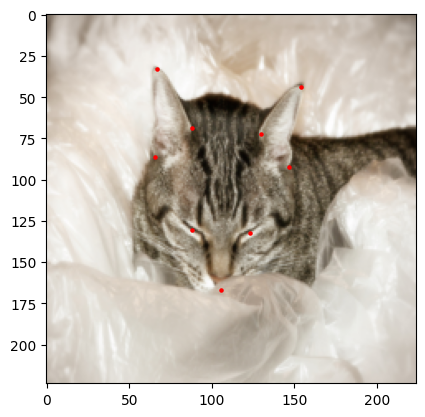

# Cat Keypoint Detection using ResNet50 + FPN
## Overview

This prokect implements a CNN for detecting keypoints on cat heads in images. The model utilizes a Feature Pyramid Network based on a pre-trained ResNet50 backbone, and it is trained to predict nine keypoints:  two for the eyes, one for the mouth, and six for the ears.

## Dataset

The dataset contains over 9,000 images of cats with corresponding annotations. Each annotation provides nine keypoints:

- Left Eye
- Right Eye
- Mouth
- Three points for the left ear
- Three points for the right ear

## Model Architecture

### 1. Backbone (ResNet50):
The backbone of the network is based on a pre-trained ResNet50 model, which is used for extracting feature maps at multiple levels (layers 3, 4, and 5).

### 2. Feature Pyramid Network (FPN):
The FPN module uses lateral connections and upsampling to merge feature maps from different ResNet layers. This helps in combining low-resolution, semantically strong features with high-resolution, semantically weak features for better localization of keypoints.

### 3. Regression Head:
The final part of the network is a regressor that flattens and concatenates the feature maps from the FPN and predicts the coordinates of the nine keypoints.

## Results

The model was trained for 20 epochs and it achived an MSE of 16.46. Here is an example prediction compared to the original:

<table>
  <tr>
    <td><strong>Prediction</strong></td>
    <td><strong>Original</strong></td>
  </tr>
  <tr>
    <td></td>
    <td></td>
  </tr>
</table>
